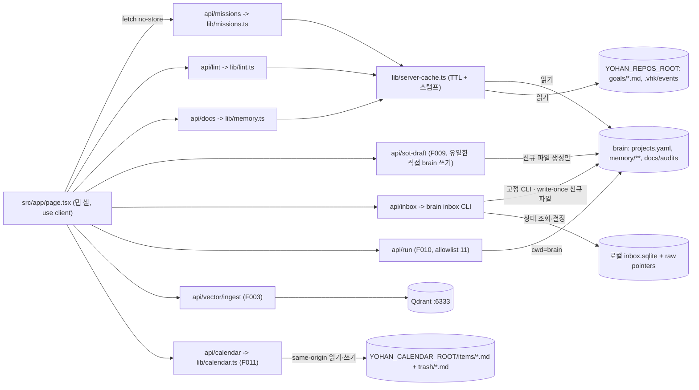

# Architecture — yohan-control-tower

> 웹앱(로컬 전용 대시보드) · 포트 3001 · **`yohan-brain/dashboard/src` 60파일 이관 후의 목표 구조**(현재 상태 아님).
> 규칙은 [`RULES.md`](../RULES.md), 기능ID·단계는 [`PRD.md`](./PRD.md) §3 이 SoT — 복제하지 않는다.
> **단계**: v1.0 = F001·F002·F003·F008·F009·F010(이관·통합, **4탭**) / v1.1 = F004·F005·F006(계층축, 홈 추가 → **5탭 동결**) / v1.2 = F011(Home 내부 Calendar). F007 = v1 OUT.

**표기** · `(이관)` = `yohan-brain/dashboard/<동일 상대경로>`에서 이동, import 무수정 · `(이동)` = 이 레포 파일 재배치 — **import 경로 + fetch URL 재작성 포함** · `(개조)` = 코드 변경 필수 · `(신규)`.
**`src/` 채택** — dashboard paths `@/* → ./src/*` vs 이 레포 `@/* → ./*`. 60 vs 37 이라 다수를 안 건드린다: 이 레포 `tsconfig.json` paths 만 바꾸고 37파일을 `src/**/vector/` 로 옮긴다. **전제 = deps 15개 선설치**(목록 PRD §10) — 미설치면 "import 무수정"이 거짓이 된다.

## 1. 시스템 경계

- **안**: 탭 셸(v1.0 4탭 → v1.1 5탭), `src/app/api/**`(파일시스템 리더·계층 집계·lint·allowlist 실행), 벡터 인제스트 파이프라인, 프로세스 내 뷰 캐시.
- **밖 — 읽기만**: brain(`YOHAN_OS_ROOT`) · 형제 레포 `goals/*.md`·`.vhk/events/*.jsonl`(`YOHAN_REPOS_ROOT`, v1.1) · `../yohan-studio/src/content/blog/*.mdx` · Notion API.
- **밖 — 쓰기 있음**: Qdrant(upsert/delete — 노션 복사본이라 재생성 가능) · brain `memory/` 에 **신규 md 생성만**(F009) · Calendar 전용 `YOHAN_CALENDAR_ROOT/items/*.md` 생성·수정과 `trash/*.md` 간 rename·복구(F011).
- **밖 — 관제탑이 기동하지 않는 로컬 데몬**: Qdrant `:6333`, Ollama `:11434`.
- **배포**: 로컬 `next dev -p 3001` 뿐. `vercel.json`(cron `/api/ingest/incremental`) **삭제** — 라우트가 POST만 export 하는데 cron 은 GET 이라 이미 고장난 채였다.
- **보안 경계**: 인증 0·localhost 바인딩 전제 → F009 Brain 쓰기 제한, F010 cwd·사람 게이트, F011 Calendar GET의 loopback 및 POST·PATCH·DELETE의 same-origin 검사를 적용한다.

## 2. 모듈 맵

| 모듈 | 경로 | 책임 | 기능ID |
|---|---|---|---|
| 탭 셸 | `src/app/page.tsx`, `layout.tsx`, `globals.css`, `components/view-tabs.tsx` (이관) | 탭 전환 + App Router 루트. **명령 실행 UI 배선**: `runServerAction`(`page.tsx:216`)이 `/api/run` 유일 호출처 → `Sidebar`·`CommandPalette` prop(`page.tsx:555`). 결과 표시는 기록 탭 | F008, F010 |
| UI 프리미티브 | `src/components/ui/*`, `header.tsx`, `sidebar.tsx`, `theme-provider.tsx`, `src/lib/utils.ts`(`cn`) (이관) | shadcn 껍데기 — `utils.ts` 는 `ui/*`·`view-tabs`·`graph-view-2d` 전부가 import, 누락 시 컴파일 불가 | F008 |
| 전역 검색 | `src/components/command-palette.tsx` (이관·**개조 완료**) + `src/app/api/search/route.ts` (이관) | 팔레트 → 문서 검색·명령 실행. **`/api/search` 로 재배선 완료**(구 `/api/nlp-command` 삭제). 자연어 의도 파싱은 되살리지 않는다 — `open_view` 5종 중 4종이 탭 지위를 잃었고, 자연어 명령 실행은 오분류 1회가 곧 실행이라 F010 사람 게이트와 충돌 | F008, F001 |
| 생태계 데이터 계약 | `src/lib/ecosystem-projects.ts` (신규) | `projects.yaml` 파싱·Goal frontmatter·완료 조건 진행률의 공용 읽기 계층 | F004, F005, F006 |
| 미션 집계 | `src/lib/missions.ts` (신규) | 공용 읽기 계층 + 레포 스캔 → 미션별 롤업 | F004 |
| 미션 API | `src/app/api/missions/route.ts` (신규) | 롤업 JSON | F004 |
| 프로젝트 드릴다운 | `src/lib/projects.ts`, `src/app/api/projects/route.ts`, `src/app/api/projects/[slug]/route.ts`, `components/project-view.tsx` (신규) | 미션 5개 → 배속 레포 → `goals/*.md` Task·완료 조건 진행률. 미클론은 `available:false` | F005 |
| 기존 할일 수집 | `src/app/api/todos/route.ts` + `components/todo-view.tsx` (이관) | Brain 한 레포의 문서 다음 액션을 Home에 공급. 프로젝트 탭의 다레포 Goal 뷰는 F005 경로로 분리 | F002 |
| 정합성 규칙 | `src/lib/lint.ts`, `config/goal-status-extensions.yaml` (신규) | 미션 미배정·미등재 레포·goal frontmatter 위반 판정. `.git` 파일 worktree와 원격 repo명≠로컬 dir 변형은 제외. 표준 4값 밖 status는 error가 아닌 warning이며 레포별 확장을 설정으로 허용 | F006 |
| lint API | `src/app/api/lint/route.ts` (신규) | 결함 목록 + 홈 배지 건수 | F006 |
| Calendar 원장 | `src/lib/calendar.ts`, `src/lib/paths.ts` (신규·개조) | 항목별 Markdown 검증·반복 발생 확장·발생일별 할일 완료·원본 수정 충돌 검사·`items/`↔`trash/` rename 복구. 2초 TTL 캐시와 앱 쓰기 후 clear | F011 |
| Calendar API·뷰 | `src/app/api/calendar/route.ts`, `components/calendar-view.tsx`, `components/home-view.tsx` (신규·개조) | 로컬 same-origin GET·POST·PATCH·DELETE, 월간·목록, 생성·수정·완료·휴지통·복구와 모바일 선택일 우선. Home 내부 보기라 탭 수 불변 | F011 |
| 문서 인덱스 | `src/lib/memory.ts`, `doc-scope.ts` (이관) | brain 문서 556건 목록·본문·통계, managed(113)/collected(443) 축 | F001 |
| 문서 API·뷰 | `src/app/api/docs/route.ts`, `docs/[...path]/route.ts` + `components/{table-view,doc-card,doc-preview}.tsx` (이관) | 목록·본문·표 | F001 |
| 문서 관계 뷰 | `src/lib/{constellation,constellation-gravity,force-sim-2d,domains}.ts` + `api/constellation/route.ts` + `components/{constellation-view,graph-view-2d}.tsx` (이관) | 문서 그래프 — **문서 탭 안의 뷰 모드**(탭 아님). 라우트는 `page.tsx:160` 이 fetch 중 | F001 |
| **인박스** | `src/app/api/sot-draft/route.ts`, `sot-draft/generate/route.ts` + `components/sot-draft-panel.tsx` (이관·**개조**) | brain 에 **신규** md 생성 — 유일한 직접 파일 쓰기 통로. 존재 검사 추가(§6-①) | **F009** |
| **요한 인박스 운영** | `src/app/api/inbox/route.ts` + `src/lib/inbox-controller.ts` + `components/yohan-inbox-panel.tsx` (신규) | brain CLI의 수집·조회·사람 결정·write-once 승격을 닫힌 argv와 stdin JSON으로 호출. SQLite·brain 파일 직접 조작 금지([ADR-001](./adr/ADR-001-local-inbox-cli-bridge.md)) | **F009 확장** |
| 타임라인·차트 | `src/components/{timeline-view,full-charts}.tsx` (이관) | 기록 탭 시간축 뷰 | F002 |
| 밤루프 감사 | `src/lib/audits.ts` + `api/overnight-status/route.ts` + `components/overnight-status-card.tsx` (이관) | overnight 요약·이월 큐 | F002 |
| 발행 상태 | `src/lib/publish.ts` + `api/publish-status/route.ts` + `components/publish-status-card.tsx` (이관·**개조**) | studio mdx 집계 — silent fallback 제거(§5) | F002 |
| 평가 이력 | `src/app/api/evaluations/route.ts` (이관) | 평가 상세 목록 | F002 |
| **명령 실행** | `src/app/api/run/route.ts` (이관·**개조**) | allowlist **11종** 실행, cwd 명시(§6-③). `git:sync`·`sync:notion:push` 는 `humanGate` 로 **서버 403**, UI(`sidebar.tsx`·`command-palette.tsx`) 목록에서도 제외 — 이중 차단 | **F010** |
| 벡터 인프라 | `src/lib/vector/{qdrant,ollama,notion,ingest,chunking,collections,producers,sources,types}.ts` (이동) | 컬렉션 보장·임베딩(bge-m3 1024d)·청킹·멱등 upsert | F003 |
| 벡터 API | `src/app/api/vector/{status,query,reset}/route.ts` + `vector/ingest/*/route.ts` 14종 (이동) | 상태·질의·인제스트 | F003 |
| 벡터 패널 | `src/components/vector/{VectorPanel,CollectionStatus,IngestButton,LogViewer,QueryTester}.tsx` (이동 + `VectorPanel` **신규 추출**) | 벡터 탭 UI. `VectorPanel` 은 탭 셸의 벡터 탭과 독립 주소 `src/app/vector/page.tsx` 가 **같은 화면을 공유**하게 하는 단일 소유자 — 어느 한쪽에만 두면 다른 쪽이 빈 껍데기가 된다 | F003 |
| 벡터 스크립트·테스트 | `scripts/vector/{init-collections,incremental-cron}.ts` + `src/lib/vector/{notion-since,qdrant-max-edited,qdrant-orphan}.test.ts` (이동) | 컬렉션 초기화·증분 cron·회귀 3건. `init-collections.ts:8-9` 의 `../lib/qdrant` → `../../src/lib/vector/qdrant` 재작성 | F003 |
| 경로 해석 | `src/lib/paths.ts` (이관·**개조**) | `YOHAN_OS_ROOT`·`YOHAN_REPOS_ROOT`·`YOHAN_CALENDAR_ROOT` 해석 (§6-②) | 전역 |
| 뷰 캐시 | `src/lib/{server-cache,docs-cache,http-cache}.ts` (이관·**개조**) | TTL + inflight dedupe + 스탬프 무효화(§3) | 전역 |
| 타입 SoT | `src/lib/types.ts` (이관) | dashboard 공용 타입 SoT. **벡터 타입은 `src/lib/vector/types.ts` 로 분리 유지** — 벡터 모듈 7개(`chunking·collections·ingest·notion·producers·qdrant·sources`) + `notion-since.test.ts:4` 가 `./types` 를 상대 import 한다. 병합하면 8곳이 깨진다 | 전역 |

**이관 제외(삭제 완료)** — 어떤 기능ID에도 안 붙던 7파일: `api/briefing`+`briefing-card.tsx` · `api/nlp-command` · `serendipity-card.tsx` · `mini-charts.tsx`(이미 미사용) · `api/vector-status`+`vector-status-card.tsx`(이 레포 `api/vector/status` 와 **중복 소유**).
카드를 지우면 그 백엔드가 죽은 코드로 남는다 — `serendipity` 는 UI 를 지운 뒤 소비자 0인 채 `memory.ts`(`pickSerendipity`+`dayHash`)·`types.ts`(`SerendipityDoc`)·`api/docs` 응답 필드에 남아 있어 **함께 제거**했다.
**탭 재편(F008) — v1.0 완료**: **4탭** = 프로젝트(←todo) · 문서(←docs+관계뷰+인박스) · 기록(←timeline+charts+run 결과) · 벡터(흡수). **v1.1** 에 홈 1개만 추가 → 5에서 동결. 기존 6탭에 신규 2를 더해 8탭이 되는 경로를 차단한다.
**동시 갱신**: `package.json` — `test` glob `lib/**/*.test.ts` → `src/lib/**/*.test.ts`, `init:collections` → `scripts/vector/init-collections.ts`. `RULES.md` — `:42` 의 `/api/reset` → `/api/vector/reset`, **타입 SoT 문장을 2축**(공용 `src/lib/types.ts` + 벡터 `src/lib/vector/types.ts`)으로.

## 3. 데이터 소유권 (SoT)

| 데이터 | 소유자 (1개) | 읽는 모듈 | 저장 위치 |
|---|---|---|---|
| Mission / Project 계층 | **brain**(외부) | `lib/missions.ts`, `lib/lint.ts` | `brain/memory/core/projects.yaml` (신규 파일) |
| Doc(556) | **brain**(외부) | `lib/memory.ts` | `brain/memory/**`, `brain/docs/**` |
| Task(Goal) | **각 레포**(외부) | `api/todos`, `api/projects/[slug]` | `<repo>/goals/*.md` frontmatter |
| Event(실행 증거) | **각 레포**(외부) | `api/projects/[slug]` | `<repo>/.vhk/events/*.jsonl` |
| CalendarItem | **Calendar 전용 로컬 원장** | `lib/calendar.ts` → `api/calendar` | 활성 `YOHAN_CALENDAR_ROOT/items/*.md`; 복구 대기 `YOHAN_CALENDAR_ROOT/trash/*.md` |
| 밤루프 감사·이월 큐 | **brain**(외부) | `lib/audits.ts` | `brain/docs/audits/overnight-*.md` |
| 발행 상태 | **yohan-studio**(외부) | `lib/publish.ts` | `../yohan-studio/src/content/blog/*.mdx` |
| 노션 페이지 | **Notion**(외부) | `lib/vector/notion.ts` | Notion API |
| 벡터 포인트 | `lib/vector/qdrant.ts` | `api/vector/*` | Qdrant `:6333` — **노션의 복사본**, 전량 재생성 가능 |
| 뷰 캐시 | `lib/server-cache.ts` | `docs-cache`, `api/{missions,lint,docs,constellation}` | 프로세스 메모리 — **복사본**, 재기동 시 소멸 |
| 인박스 초안 | `api/sot-draft` → **brain** | `lib/memory.ts` | `brain/memory/{decisions,insights}/` |
| 요한 인박스 큐·승격 영수증 | **yohan-brain CLI**(외부) | `api/inbox` → `lib/inbox-controller.ts` | 로컬 SQLite + brain 신규 정본 파일 |

**소유권 시간축 이양**: 인박스 초안과 Doc 은 같은 `brain/memory/**` 를 쓰지만 충돌이 아니다 — **생성 순간에만 관제탑 소유(쓰기), 존재한 뒤부터는 brain 소유(읽기 전용)**. 그래서 §6-① 이 "존재하면 거부"다.

**스캔 비용 대응**: `missions.ts`·`lint.ts` 는 `createTtlCache` 를 거친다. 단 **현행 `server-cache.ts:9-47` 은 캐시 키가 없는 단일 슬롯 memoizer(`get(load)` 만 받음)라 mtime 무효화가 구현 불가** → `validate?: () => Promise<string>` 스탬프 콜백 **개조**가 선행돼야 한다. 스탬프 산식 = `YOHAN_REPOS_ROOT` readdir 1 + `goals/` 디렉토리 stat 6 + `projects.yaml` stat 1 = 8 → **요청당 fs 호출 ≤10 상한, 레포 전체 워크 금지.**

## 4. 데이터 흐름

1. **홈 롤업(v1.1, F004·F006)**: 셸 → `GET /api/missions|/api/lint` → 공용 parser → `projects.yaml` + `goals/` 스캔 → 롤업·actionable 결함 배지.
2. **프로젝트 드릴다운(F005)**: Home 미션 카드 → 선택 ID를 프로젝트 탭에 전달 → `GET /api/projects` → 레포 선택 → `GET /api/projects/[slug]` → Goal 원시 status·priority·Completion Check 표시.
3. **인박스(F009)**: 패널 → `POST /api/sot-draft` → **경로 존재 검사** → brain md 생성 → `clearDocsCache()`.
4. **벡터 인제스트(F003)**: 버튼 → `POST /api/vector/ingest/<source>` → 노션 페치 → 청킹 → Ollama 임베딩 → Qdrant 결정적 ID upsert(멱등).
5. **요한 인박스 운영(F009 확장)**: 패널 → `GET|POST /api/inbox` → `lib/inbox-controller.ts` → 고정 yohan-brain CLI. 조회는 status 뒤 active 목록을 100건 단위 offset 페이지로 순차 수집하고, 총계와 표시 건수가 다르면 0건으로 위장하지 않는다. 사람 결정과 정본 승격은 별도 요청이며 관제탑은 SQLite·정본 파일을 직접 열지 않는다.
6. **Calendar(F011)**: Home 내부 `개요 / 캘린더` → `GET|POST|PATCH|DELETE /api/calendar` → 항목별 Markdown. 반복은 요청 범위에서 파생하며 반복 할일 완료는 `completed_dates`에 발생일만 기록한다. 수정·휴지통 이동은 클라이언트가 받은 `expectedUpdatedAt`을 비교해 외부 파일 변경을 409로 보호한다. 삭제 확인 후 원문 바이트를 `trash/`로 rename하고, 복구는 활성 ID 충돌이 없을 때 같은 원문을 `items/`로 되돌린다.

## 5. 외부 의존 + 실패 모드

| 의존 | 용도 | 죽으면 어떻게 되나 |
|---|---|---|
| **brain 루트 `YOHAN_OS_ROOT`** | 모든 SoT | **하드 실패** — env 미설정이면 throw. cwd 추론 폴백 전면 금지(§6-②) |
| **레포 스캔 루트 `YOHAN_REPOS_ROOT`** (신규 env, v1.1) | F004·F005·F006 의 레포 열거 | **하드 실패** — 미설정 시 throw. `YOHAN_OS_ROOT` 는 brain 을 가리키고 §6-② 가 `cwd/..` 추론을 금지하므로 별도 env 가 필수다. 실측: 형제 13 + 자기 1 = **14 중 `goals/` 디렉토리 보유 6개, 그중 goal md 보유 5개**(vhk 52·brain 14·studio 10·voice 3·control-tower 1 / `vhk-privacy-v3` 는 디렉토리만 있고 0건). 필터 = 워크트리·변형 디렉토리 제외(PRD §3 F006) |
| **Calendar 루트 `YOHAN_CALENDAR_ROOT`** | F011 일정·할일 원장·휴지통 | 미설정은 `setupRequired`, 상대경로는 거부. `items/`·`trash/` 손상 파일은 `issues[]`로 표면화하며 다른 정상 파일은 유지. 오래된 수정·삭제와 복구 ID 충돌은 409 |
| **`projects.yaml` 부재** | 미션 계층 | **첫 실행 시 반드시 부재 = 정상 초기 상태.** `{ok:true, missions:[], setupRequired:true}` 로 **명시 구별 신호** 반환. 미션 0개·Task 0개로 조용히 표시 금지 |
| Qdrant `:6333` | 벡터 저장·검색 | **degrade** — `api/vector/status` 가 `connected:false`+error(`app/api/status/route.ts:29-31`), 벡터 탭만 접힘. 인제스트·질의는 **하드 실패**(5xx). 30초 타임아웃 |
| Ollama `:11434` | bge-m3 임베딩 | **degrade** — `ollamaStatus()` 3초 타임아웃 후 `available:false`+사유(모델 미설치까지 구분). 임베딩 호출 자체는 차원 불일치 시 throw = **하드 실패** |
| Notion API | 벡터 원본 | **degrade** — `notionConfigured()` false 면 인제스트 비활성 + 미설정 표시. 토큰 없이 0건 성공 처리 금지 |
| `../yohan-studio` | 발행 상태(F002) | **현행이 silent fallback = §6-⑤ 위반** — `publish.ts:31-33` 이 `catch { return EMPTY }`(0/0/0)를 정상 반환해 `publish-status/route.ts:10` 이 `ok:true`+0건을 낸다 → 레포 부재와 "글 0편" 구별 불가. **개조**: `{available:false, reason}` 반환 + 라우트가 `ok:false` 를 실제로 내보낸다 |

## 6. 불변식

일반 코딩·보안·AI 제안 규칙은 [`RULES.md`](../RULES.md) §코딩·§보안·§프론트 아키텍처 참조. 아래는 **이 아키텍처 고유**의 것만.

1. **관제탑의 brain 직접 쓰기 통로는 `api/sot-draft/**`(F009) 하나뿐이고 새 경로 생성만 한다.** 대상 절대경로가 이미 있으면 409 거부한다. `api/inbox`는 직접 파일을 쓰지 않고 [ADR-001](./adr/ADR-001-local-inbox-cli-bridge.md)의 고정 yohan-brain CLI에 위임하며, 그 CLI도 UUID 고정 write-once 신규 파일만 만든다. 관제탑에서 SQLite·정본 경로를 직접 여는 우회는 금지한다. 근거 계약은 active `ecosystem-contract.yaml` v0.3.0의 `control_tower.must_not: modify_existing_brain_files`다(2026-08-07 재검증).
2. **`resolveRepoRoot()` 는 env 없으면 무조건 throw.** 현행 `paths.ts:11-21` 폴백 4단계 중 **2·3·4 전부 제거**. 3·4(`cwd/..`)만 지우면 폴백 2(`cwd/memory` 있으면 cwd)가 남아, 이 레포에 `memory/` 가 생기는 순간 자기를 brain 으로 조용히 해석한다.
3. **F010 의 모든 액션은 `root: "brain"` 필수 필드를 갖는다** — 옵셔널·기본값·암묵 폴백 금지. 현행 `ROOT = resolve(process.cwd(), "..")`(`run/route.ts:7`)는 `brain/dashboard` 안이라서만 맞았고, 이관하면 `..`=`yohan-ecosystem/` 이라 **11개 액션 전부 엉뚱한 디렉토리에서 실행**된다. `"self"` 리터럴은 만들지 않는다(11종 전부 brain 명령 = 사용처 0).
4. **탭 상한 5.** `ViewTab` union(`view-tabs.tsx`)이 SoT — **v1.0 은 4 리터럴, v1.1 에 `home` 1개만 추가해 5에서 동결. 6번째 금지.**
   - 기본 진입 탭은 `page.tsx:103` 의 `useState<ViewTab>` 초기값 하나가 정한다. v1.0 = `docs`(PRD §6 오너 판정), v1.1 = `home`.
5. **외부 의존 실패는 `ok:false`+`error` 또는 `setupRequired` 로 표면화한다.** 빈 배열·0·마지막 성공값을 정상값처럼 반환 금지(§5 studio 행이 이 위반의 실례).
6. **fs 스캔은 전부 `server-cache` 를 거친다.** 라우트가 `listDocs()`·레포 워크를 직접 호출하지 않는다.
7. **brain 절대경로는 `resolveRepoRoot()` 로만 얻는다 — `process.cwd()` 기준 상대 이동 금지.** ③이 `api/run` 만 지목했지만 **같은 결함이 2곳 더 있었다**: `api/search:8`·`api/sot-draft/generate:7` 의 `config({ path: resolve(cwd, "..", ".env") })`. 이관 후 `yohan-ecosystem/.env` 를 가리켜 아무것도 안 읽었고(dev 로그 `injected env (0)`), brain `.env` 의 `OPENAI_API_KEY` 가 유실됐다. 시스템 env 에 같은 키가 있어 **우연히 동작 중**이라 정적 게이트 4종이 전부 통과했다 — 실기동에서만 드러났다. 해결: `lib/paths.ts` 의 `loadBrainEnv()`(lazy + 1회) 를 요청 처리 중에 호출.
8. **Calendar 삭제는 영구 삭제가 아니다.** DELETE는 확인된 항목의 원문을 `items/`에서 `trash/`로 `rename`만 하며 `unlink`를 사용하지 않는다. 복구 키는 엄격한 파일명 패턴으로 검증하고 활성 ID 충돌 시 덮어쓰지 않는다. 수정·삭제 모두 `expectedUpdatedAt`이 일치해야 하며 성공 전 UI에서 낙관적으로 제거하지 않는다.

## 7. 기술 스택

Next.js 16.2.9 (App Router, node runtime) · React 19.2.4 · TypeScript 5 strict · Tailwind 4 + shadcn(base-nova) + `@base-ui/react`·`tw-animate-css`·`@tailwindcss/typography` · **`three` + `@react-three/fiber` + `@react-three/drei`**(`constellation-view.tsx:3-6` 이 실제 import) · recharts · react-markdown + remark-gfm · gray-matter · lucide-react · clsx+tailwind-merge+cva · `@qdrant/js-client-rest` 1.18 · `ollama` 0.6 · `@notionhq/client` 5.22 · pnpm. **DB 없음** — 서버 라우트가 로컬 파일시스템을 직접 읽는다.

## 8. 렌더링 경계 (웹앱 축)

- **서버**: `src/app/api/**` route handler 전부(`dynamic = "force-dynamic"` + node runtime). fs·child_process 접근은 여기서만.
- **클라이언트**: `src/app/page.tsx` 가 `"use client"` 단일 셸. 탭 뷰는 전부 클라이언트, 무거운 뷰(constellation·graph-2d)는 `next/dynamic` + `ssr:false`.
- **페칭 지점**: 클라이언트 `fetch("/api/...", { cache: "no-store" })` 뿐. 서버 컴포넌트에서 fs 를 직접 읽는 경로는 만들지 않는다(캐시 우회 방지, §6-⑥).
- **상태 소유**: 서버 = 파일시스템 파생 데이터 + TTL 캐시. 클라이언트 = 탭/필터/선택 등 UI 상태만 — 도메인 데이터로 파생 계산하지 않는다.
